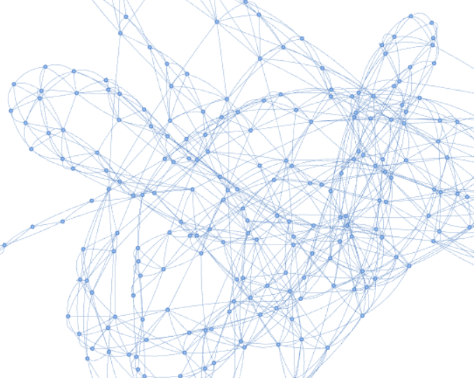
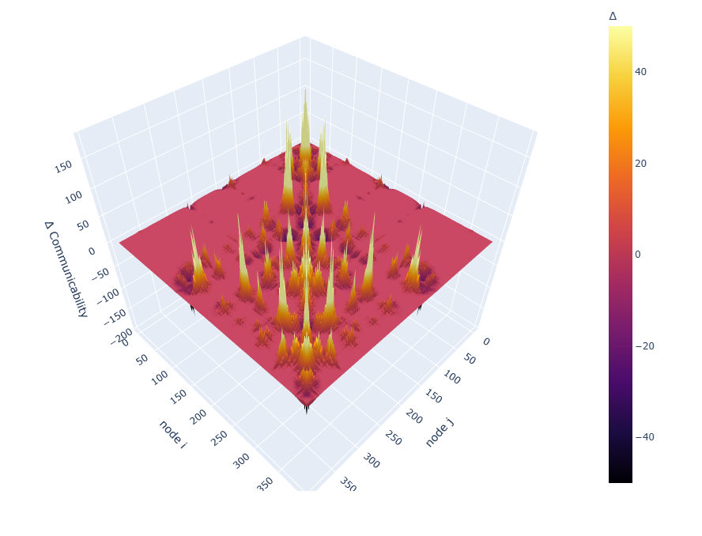

# ProTMD - Protein Molecular Dynamics Analyzer

<p align="center">
  
  
</p>

**ProTMD** is a Python library designed for the comprehensive analysis of Molecular Dynamics (MD) trajectories. It bridges the gap between standard structural metrics and advanced graph-theoretical analysis, allowing researchers to explore protein flexibility, essential dynamics, and temporal residue-residue communication.

---

## 🚀 Key Features

- Structural Analytics: Automated computation of RMSD, RMSF, and Radius of Gyration ($R_g$).  

- Essential Dynamics (PCA): Perform Principal Component Analysis on $C\alpha$ trajectories to identify dominant collective motions.  

- Correlation Mapping: Dynamic Cross-Correlation Maps (DCCM) to visualize residue coupling.

- Temporal Protein Networks:
    - Dynamic Adjacency Matrices based on distance cutoffs.
    - Communicability Analysis: Uses matrix exponentials ($e^A$) to quantify all-atom communication pathways.

- Interactive Visualizations: High-quality plots using Plotly (3D surfaces, interactive line plots) and PyVis (interactive network graphs).

---

## 🛠 Installation

Clone the repository and install dependencies:

```bash
git clone https://github.com/Top-Nuttawat/ProTMD-Protein_Molecular_Dynamics_Analyzer.git
```
```bash
cd ProTMD-Protein_Molecular_Dynamics_Analyzer
```
```bash
pip install -r requirements.txt
```
For jupyter notebook

```bash
!pip install git+https://github.com/Top-Nuttawat/ProTMD-Protein_Molecular_Dynamics_Analyzer.git
```


---
## 📖 Quick Start

```bash
# ProTMD-Protein_Molecular_Dynamics_Analyzer
import ProTMD as ptmd
from ProTMD.ProTstructure import Protein_Structure
from ProTMD.ProTNetwork import Temporal_ProteinNetwork
```

1. Basic Structural Analysis


```bash
# Initialize with GROMACS files
prot = Protein_Structure("protein.gro", "trajectory.xtc")

# MD trajectories analysis

prot.compute_RMSD()
prot.compute_RMSF()
prot.compute_Rg()
prot.compute_DCCM()

# Plot MD trajectories analysis

prot.plot_RMSD()
prot.plot_RMSF()
prot.plot_Rg()
prot.plot_DCCM()


# Principal Component Analysis
prot.compute_PCA(start=800, end=2000, trim_residues=(0, 375))

prot.plot_PCA_scree()

prot.write_eigenmode_XYZ(mode_index=0, amplitude=10.0) # Visualize PC1

```
2. Temporal Network Analysis

Explore how residues communicate over time using graph theory.

```bash
# Build network with an 7.4 Å cutoff
Protnet = Temporal_ProteinNetwork(PDB, XTC, cutoff=7.4, start_frame=1500)

# Adjacency matrix

Protnet.A_time

Protnet.plot_A_matrix(frame = 50)

# Communicability matrix
Protnet.G_matrix_function_time

Protnet.plotmap_Communicability_Matrix(frame = 50)

# Visualize the network at a specific frame (interactive HTML)

Protnet.ProTNetworks(frame = 50)

# 3D Communicability Surface (exp(A))
Protnet.plot3D_Communicability_matrix(frame = 50)

```

---
## 📊 Module Overview

## `Protein_Structure`

Focuses on the geometry and collective motion of the protein.

| Method | Description |
|--------|------------|
| `compute_RMSD()` | Root Mean Square Deviation vs. Reference. |
| `compute_RMSF()` | Per-residue fluctuation (flexibility). |
| `compute_DCCM()` | Correlated motion between residue pairs. |
| `compute_PCA()` | Eigen-decomposition of the covariance matrix. |


##  `Temporal_ProteinNetwork`

Treats the protein as a dynamic graph where nodes are $C\alpha$ atoms.

| Method | Description |
|--------|------------|
| `Temporal_Adjacency_Matrix()` |Binary contact maps over time. |
| `Temporal_Communicability()` | Calculates $e^A$ to identify "hubs" of information flow.|
| `ProTNetworks()` | Exports interactive network graphs using NetworkX and PyVis. |

---

##  Dependencies
- MDAnalysis: Trajectory parsing
- NetworkX & PyVis: Graph theory and network visualization.
- Plotly: Interactive 3D and 2D plotting.
- Scikit-learn: PCA implementation.
- SciPy: Matrix exponentials for communicability.
---

##  ✍️ Author

Nuttawat Sawang  , M.Sc. (Physics)

Theoretical and Computational Physics (TCP) at KMUTT


📧 topza200915@gmail.com / nuttawatsawang.top@gmail.com

